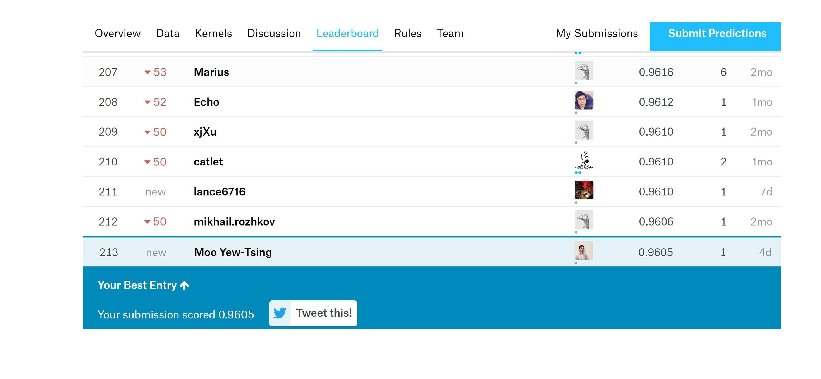
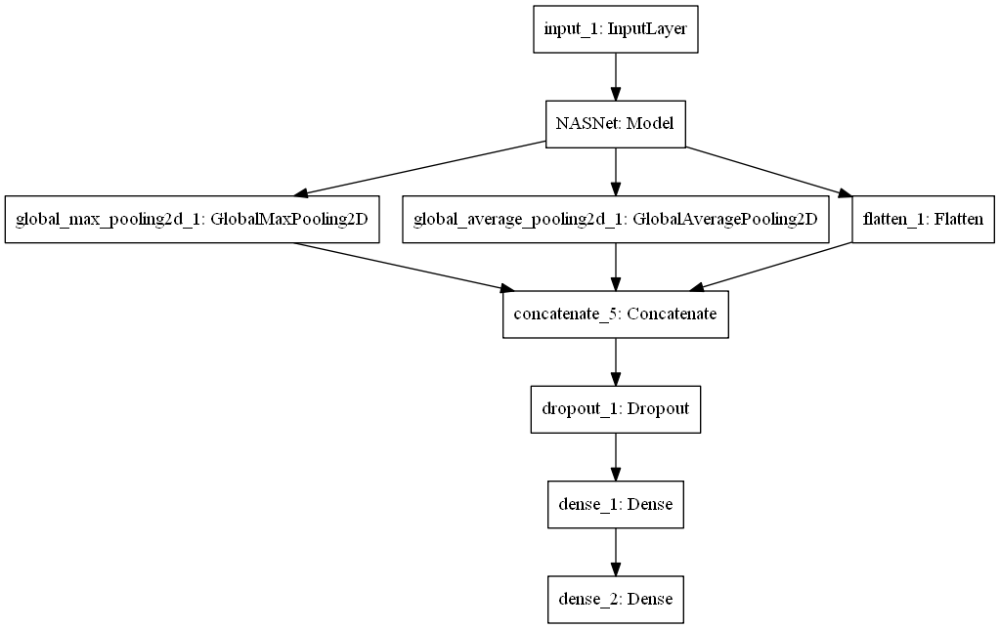
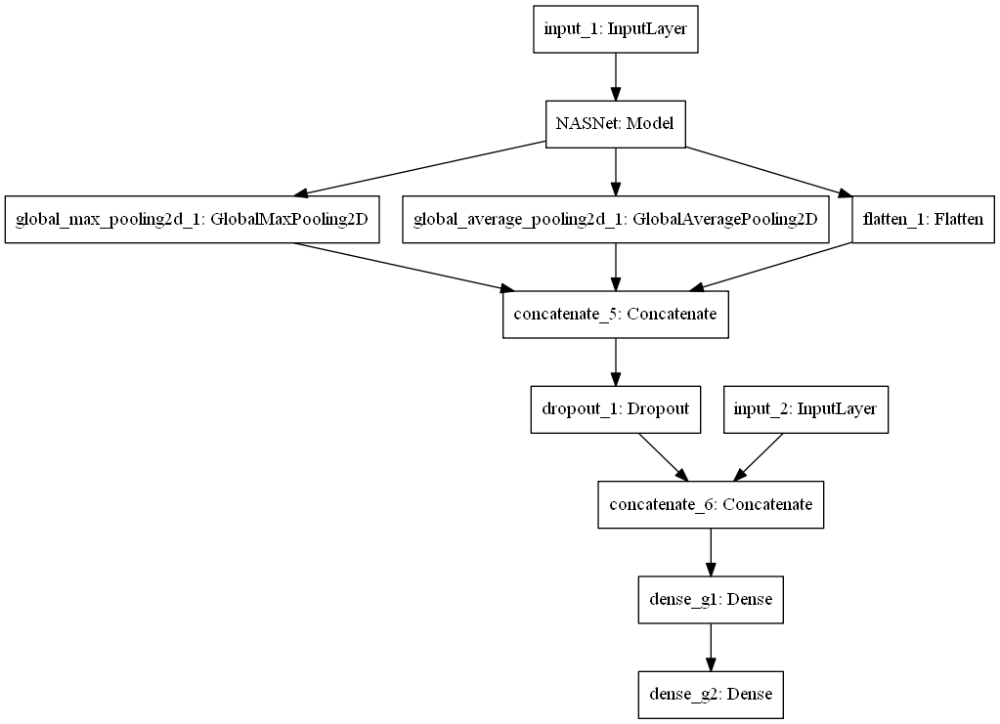
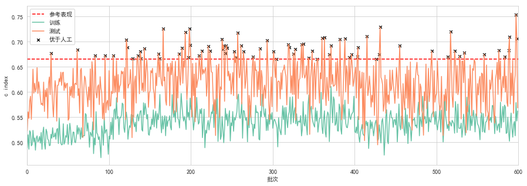

# Survival-Analysis-by-Breast-Cancer-Slides

A backup for my undergraduate thesis.

## 1 Construction

### 1.1 Baseline Data Preparation

I used the morphologic data created doctors manually to set up a Cox Proportional Hazard model. The outcome of this model will help me to judge whether the deep learning model is better than the professionals.

### 1.2 Data Preparation

I used the authentic National Institutes of Health (NIH)'s Harmonized Cancer Datasets as my data source. I aimed to do survival analysis based on images. For survival analysis, the indispensable part of information is the duration from the start to the occurrence of the event and whether the event is censoed, that is the event didn't happen during the certain period of time.

From my dataset, I only need cases who have complete information that can satisfy the survial analysis requirement above. Also, for the sake of fair comparison, I decided to use the same samples which the baseline used. Besides, 9 cases are from male. Considering the gender may paly a large role in breast cancer, since it's rare to form in the breast tissue of men [see here](https://www.mayoclinic.org/diseases-conditions/male-breast-cancer/symptoms-causes/syc-20374740). So I removed all the male cases. Then the gender factor will not influence both models. Finally, I gathered 759 cases.

The server I worked on is a RedHat system. I am not familiar with this kind of corporation system. It doesnt't support agt and some other Ubuntu command. Even worse, I didn't have the administrator permission. As a result, I cannot install software by yum or rpm etc. commands. The only environment I can use is Anaconda.

Luckily, the GDC download software (GDC Data Transfer Tool) published by NIH have a python version. So, I can download the TCGA slices I needed automaticly. All slices are Formalin-Fixed Paraffin-Embedded (FFPE) from TCGA-BRCA.

### 1.3 Image Data Preprocession

The slices are [.svs files](http://fileformats.archiveteam.org/wiki/Aperio_SVS). Those files have pyramid-like magnitude, that is they have three or four magnitudes or powers, and in different magnitudes, the resolution they are in is different. Recent researchs using medical slices usually set the slides in 20X or 10 X power, which can achieve a beautiful balance between computing usage and outcome quality, like this [paper](http://www.pnas.org/content/early/2018/03/09/1717139115).

Here, I conduct my study using 10X power images. It's because I only have limited the computing resource, i.e., 3G GTX1060. Also, similar exploration, like the competition in [Kaggle in 2018](https://www.kaggle.com/c/histopathologic-cancer-detection), process images into 96 pixels * 96 pixels small 10X power, resulting an impressive performance of classification cancer type, whether it is metastatsis.

In 10X power, the images' resolution is range from 2.30e+07 to 2.69e+09. Currently, if I simply make a whole image as input into the RAM(random access memory), it will occupy 23GB on average (if dtype == uint8). However, typical computers usually have 32G RAM. Also, cancer cells can scatter around the images, since in 10X power, the cancer cells occupy about 8*8 pixels. Besides, large blank areas are in each slides, and tissues sometimes are recorded twice in one slides. Consequently, it's not realistic nor necessary to use the whole image. On top of that, each slide should be segmented into small images and rule out the images with little or replicated content.

One thing is worth noticing that the segmentation of large slides is usually completed manually. Experienced professors can identify the ROIs (regions of interest) empirically. However, due to the lack of outside expertise assistance, I couldn't rely on manual ROIs identication. First, I want to search the cancer location on the server by other models like [Baidu's NCRF](https://openreview.net/forum?id=S1aY66iiM) or [Google's Lyna](https://doi.org/10.5858/arpa.2018-0147-OA). Unfortunately, NCRF run in a environment where computing resource is abundant and the running time is laxly considered, and Lyna hasn't open its source code before I finish my study. As a result, I use my home-made model adapted from one [Kaggle's kernel](https://www.kaggle.com/CVxTz/cnn-starter-nasnet-mobile-0-9709-lb), which is based on Google's Nasnet to identify the ROIs.

To begin with, I segment whole slides in 10X power into 96 pixel * 96 pixels small .tiff images. The format .tiff is based on (CMYK), which is different from RGB [see here](https://en.wikipedia.org/wiki/CMYK_color_model). It's because the .svs files are created from individul .tiff files in the first place, and I used the Kaggle data that is in .tiff format to train the model for ROI identification. Different picture format use varing ways to represent the colour, so it's curcial to make sure the image format models are trained on is consistent with that the models will predict.

---

### 1.4 Home-made Model

#### 1.4.1 DATA PROFILE

The PCam dataset is derived from the Camelyon16 Challenge dataset which contains 400 H&E stained whole slide images using a 40x objective. This one uses 10x undersampling to increase the field of view, which gives the resultant pixel resolution of 2.43 microns.

All slides were inspected manually after scanning. The inspection was performed by an experienced technician (Q.M. and N.S. for UMCU, M.H. or R.vd.L. for the other centers) to assess the quality of the scan.

The negative/positive ratio is not entirely 50/50, as the label mean is well below 0.5.

The ratio is closer to 60/40 meaning that there are 1.5 times more negative images than positives.

#### 1.4.2 AUGMENTATION

- horizontally flip 50% of all images
- vertically flip 20% of all images
- scale images to 80-120% of their size, individually per axis
- translate by -20 to +20 percent (per axis)
- rotate by -45 to +45 degrees
- blur images with a sigma between 0 and 3.0
- ...​

#### 1.4.3 NASNET

NASNet performs 1.2% better than all previously published results.

NASNet may be resized to produce a family of models that achieve good accuracies while having very low computational costs.


Zoph B , Vasudevan V , Shlens J , et al. Learning Transferable Architectures for Scalable Image Recognition[J]. 2017.

#### 1.4.4 PERFORMANCE



### 1.5 SNAS Architecture

The raw model.



Put genome data into the model, and form the one below.



#### 1.5.1 Loss function

```python
from keras import backend as K
def negative_log_likelihood(E):
    def loss(y_true,y_pred):
        hazard_ratio = K.exp(y_pred)
        log_risk = K.log(K.cumsum(hazard_ratio))
        uncensored_likelihood = K.transpose(y_pred) - log_risk
        censored_likelihood = uncensored_likelihood * E
        num_observed_event = K.sum([float(e) for e in E]) + 1
        return K.sum(censored_likelihood) / num_observed_event * (-1)
    return loss
```

Adapted from [DeepSurv_Keras](https://github.com/mexchy1000/DeepSurv_Keras)

#### 1.5.2 Completed model

The main function is in **main.py**.

### 1.6 Result



The models with red marker are which with better performance than base Cox PH model.

(My thesis is required to be written in Chinese. I have to spare time to complete my thesis, and then, I have no time to do the translation job, sorry. More results are in **/data/figs.zip**. However, they are created in Chinese. Raw data are in **/data/tables.zip**)

## 2 Usage

There are two major ways to use the software.

### 2.1 Installation

#### 2.1.1 Miniconda -- Python data science platform

To shorten the download time. We first recommend download Miniconda, which provides the basic *conda* platform for our application. See [Miniconda](https://conda.io/miniconda.html) download page. Currently, you need to download Python 3.7 version.

Or, see [Anaconda](https://www.anaconda.com/download/) download page. Currently, you need to download Python 3.7 version as well. For more details, please check its [official documentation](https://docs.anaconda.com/anaconda/).

There is no difference between these two versions if you only consider testing our software. If you are interested in Python and want to learn more about it, Anaconda is a better choice. Anaconda supply many pre-installed packages that can save lots of time in the long run.

#### 2.1.2 Required packages

**For Chinese Users, we recommend you input following commands in your Anaconda Prompt to use the [mirror](https://mirror.tuna.tsinghua.edu.cn/help/anaconda/) from Tsinghua University.**

    conda config --add channels https://mirrors.tuna.tsinghua.edu.cn/anaconda/pkgs/free/

    conda config --add channels https://mirrors.tuna.tsinghua.edu.cn/anaconda/pkgs/main/

    conda config --set show_channel_urls yes

**Follow the messages [here](https://openslide.org/download/) to install Openslide.**

Make sure your CUDA driving is [updated](https://www.nvidia.com/Download/index.aspx?lang=en-us).

To Continue, input following commands in your Anaconda Prompt

    conda create --name snas python=3.7 tensorflow tensorflow-gpu opencv pandas keras scikit-learn matplotlib scikit-image openpyxl tqdm six numpy scipy Pillow imageio Shapely

    pip install lifelines imgaug

#### 2.1.3 Clone or Download

We recommend you use git to _clone_ the repository. by

    git clone https://github.com/Moo-YewTsing/Survival-Analysis-by-Breast-Cancer-Slides.git

Or you can simply _download_ all by this [link](https://github.com/Moo-YewTsing/Survival-Analysis-by-Breast-Cancer-Slides/archive/master.zip).

Open your terminal, _cd_ to the directory where the repository's files are.

### 2.2 Train model from tiled images

    python main.py input_dir output_dir **other_para

It's self-explanatory.

```python
    parse.add_argument('i', help='the path of directory that saves imgs for cases')
    parse.add_argument('-o', default='..', help='the path for output')
    parse.add_argument('-r', type=float, default=0.8, help='training size')
    parse.add_argument('-m', type=str, default='', help='the path of trained weights')
    parse.add_argument('-t', type=int, default=40, help='epochs')
    parse.add_argument('-v', type=bool, default=False, help='validation only')
    parse.add_argument('-s', type=int, default=42, help='the num of imgs used for validation')
    parse.add_argument('-a', type=int, default=0, help='the time of augmentation during training')
    parse.add_argument('-p', type=bool, default=False, help='whether plot the model and save it in dst')
    parse.add_argument('-d', type=int, default=256, help="the size of model's key dense layer")
    parse.add_argument('-g', type=bool, default=False, help="use gene info to train")
```

### 2.3 Pipeline train & predict from .sys files

    python from_svs.py input_dir output_dir **other_para

Also, it's self-explanatory.  

```python
    parse.add_argument('i', help='the path of directory that saves imgs for cases')
    parse.add_argument('o', help='the path for output')
    parse.add_argument('-m', default='train', help='the working mode, if you want to use the prediction mode, just type "val"')
```

## 3 Progress

- [x] Set baseline.

- [x] Gather qualified slides.

- [x] Search the cancer location ~~on the server by other programs, like the Baidu's ncrf or SNAS~~. (I fact, I used a home-made model based on Google's NASNet locally. The server doesn't have GPU. A nightmare for image computation.)

- [x] Get the patch in which only important cancar areas are by using the location of cancer.

- [x] Move the patches to local, so that I can use my computer with GPU to train the SNAS.

- [x] Analysis the performance of SNAS.

- [x] Wrap up to form a ".svs to model" end-to-end pipeline.

- [ ] Test.

## 4 Links for Further Reading

Data Source
[GDC](https://portal.gdc.cancer.gov/)

Download Tools
[gdc-data-transfer-tool](https://gdc.cancer.gov/access-data/gdc-data-transfer-tool)

[Used on red-hat](https://gist.github.com/sbamin/7f33b26198a00ad6846d124b8ba8d2b4)

Slices Preparation
[download tcga digital pathology images ffpe](http://www.andrewjanowczyk.com/download-tcga-digital-pathology-images-ffpe/)